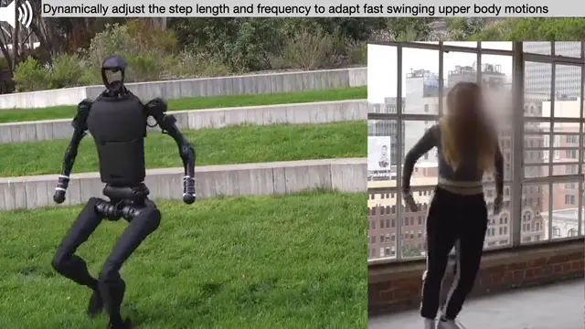

<h1 align="center">Expressive Whole-Body Control for <br> Humanoid Robots</h1>

<p align="center">
    <a href="https://chengxuxin.github.io/"><strong>Xuxin Cheng*</strong></a>
    ·
    <a href="https://yandongji.github.io/"><strong>Yandong Ji*</strong></a>
    ·
    <a href="https://jeremycjm.github.io/"><strong>Junming Chen</strong></a>
    <br>
    <a href="https://www.episodeyang.com/"><strong>Ge Yang</strong></a>
    ·
    <a href="https://xiaolonw.github.io/"><strong>Xiaolong Wang</strong></a>
</p>

<p align="center">
    
</p>

<p align="center">
<h3 align="center"><a href="https://expressive-humanoid.github.io/">Website</a> | <a href="https://arxiv.org/abs/2402.16796">arXiv</a> | <a href="https://youtu.be/UGA9YAg3e-M">Video</a> | <a href="https://x.com/xiaolonw/status/1762528106001379369">Summary</a> </h3>
  <div align="center"></div>
</p>

<p align="center">

</p>

## Installation ##
```bash
conda create -n humanoid python=3.8
conda activate humanoid
cd
pip3 install torch==1.10.0+cu113 torchvision==0.11.1+cu113 torchaudio==0.10.0+cu113 -f https://download.pytorch.org/whl/cu113/torch_stable.html
git clone git@github.com:chengxuxin/expressive_humanoid.git
cd expressive_humanoid
# Download the Isaac Gym binaries from https://developer.nvidia.com/isaac-gym 
cd isaacgym/python && pip install -e .
cd ~/expressive_humanoid/rsl_rl && pip install -e .
cd ~/expressive_humanoid/legged_gym && pip install -e .
pip install "numpy<1.24" pydelatin wandb tqdm opencv-python ipdb pyfqmr flask dill gdown
```
Next install fbx. Follow the instructions [here](https://github.com/nv-tlabs/ASE/issues/61).

## Prepare dataset
1. Download from [here](https://drive.google.com/file/d/1m3JRBox51cjV4CbiKIcVXR6eKQBjaAhO/view?usp=sharing) and extract the zip file to `ASE/ase/poselib/data/cmu_fbx_all` that contains all `.fbx` files.

2. Gnerate `.yaml` file for the motions you want to use. 
```bash
cd ASE/ase/poselib
python parse_cmu_mocap_all.py
```
This step is not mandatory because the `.yaml` file is already generated. But if you want to add more motions, you can use this script to generate the `.yaml` file.

3. Import motions 
```bash
cd ASE/ase/poselib
python fbx_importer_all.py
```
This will import all motions in CMU Mocap dataset into `ASE/ase/poselib/data/npy`.

4. Retarget motions
```bash
cd ASE/ase/poselib
mkdir pkl retarget_npy
python retarget_motion_h1_all.py
```
This will retarget all motions in `ASE/ase/poselib/data/npy` to `ASE/ase/poselib/data/retarget_npy`.

5. Gnerate keybody positions

This step will require running simulation to extract more precise key body positions. 
```bash
cd legged_gym/legged_gym/scripts
python train.py debug --task h1_view --motion_name motions_debug.yaml --debug
```
Train for 1 iteration and kill the program to have a dummy model to load. 
```bash
python play.py debug --task h1_view --motion_name motions_autogen_all.yaml
```
It is recommended to use `motions_autogen_all.yaml` at the first time, so that later if you have a subset it is not neccessary to regenerate keybody positions. This will generate keybody positions to `ASE/ase/poselib/data/retarget_npy`.
Set wandb asset: 

## Usage 
To train a new policy
```bash
python train.py xxx-xx-some_descriptions_of_run --device cuda:0 --entity WANDB_ENTITY
```
`xxx-xx` is usually an id like `000-01`. `motion_type` and `motion_name` are defined in `legged_gym/legged_gym/envs/h1/h1_mimic_config.py`. They can be also given as arguments. Can set default WANDB_ENTITY in `legged_gym/legged_gym/utils/helpers.py`.

To play a policy
```bash
python play.py xxx-xx
```
No need to write the full experimentt id. The parser will auto match runs with first 6 strings (xxx-xx). So better make sure you don't reuse xxx-xx. Delay is added after 8k iters. If you want to play after 8k, add `--delay`.

To play with example pretrained models
```bash
python play.py 060-40 --delay --motion_name motions_debug.yaml
```
Try to press `+` or `-` to see different motions. The motion name will be printed on terminal. `motions_debug.yaml` is a small subset of motions for debugging and contains some representative motions.

5. Save models for deployment:
```bash
python save_jit.py --exptid xxx-xx
```
This will save the models in `legged_gym/logs/parkour_new/xxx-xx/traced/`.

### Viewer Usage
Can be used in both IsaacGym and web viewer.
- `ALT + Mouse Left + Drag Mouse`: move view.
- `[ ]`: switch to next/prev robot.
- `Space`: pause/unpause.
- `F`: switch between free camera and following camera.

### IsaacGym viewer specific
- `+`: next motion in yaml. 
- `-`: prev motion in yaml.
- `r`: reset the motion to the beginning.
- `]`: camera focus on next env.
- `[`: camera focus on prev env.

### Arguments
- --exptid: string, can be `xxx-xx-WHATEVER`, `xxx-xx` is typically numbers only. `WHATEVER` is the description of the run. 
- --device: can be `cuda:0`, `cpu`, etc.
- --delay: whether add delay or not.
- --checkpoint: the specific checkpoint you want to load. If not specified load the latest one.
- --resume: resume from another checkpoint, used together with `--resumeid`.
- --seed: random seed.
- --no_wandb: no wandb logging.
- --entity: specify wandb entity
- --web: used for playing on headless machines. It will forward a port with vscode and you can visualize seemlessly in vscode with your idle gpu or cpu. [Live Preview](https://marketplace.visualstudio.com/items?itemName=ms-vscode.live-server) vscode extension required, otherwise you can view it in any browser.
- --motion_name: e.g. `07_04` or `motions_all.yaml`. If `motions_all.yaml` is used, `motion_type` should be `yaml`.
- --motion_type: `single` or `yaml`
- --fix_base: fix the base of the robot.

For more arguments, refer `legged_gym/utils/helpers.py`.

### Acknowledgement
We derive the retargetting code from [ASE](https://github.com/nv-tlabs/ASE.git).